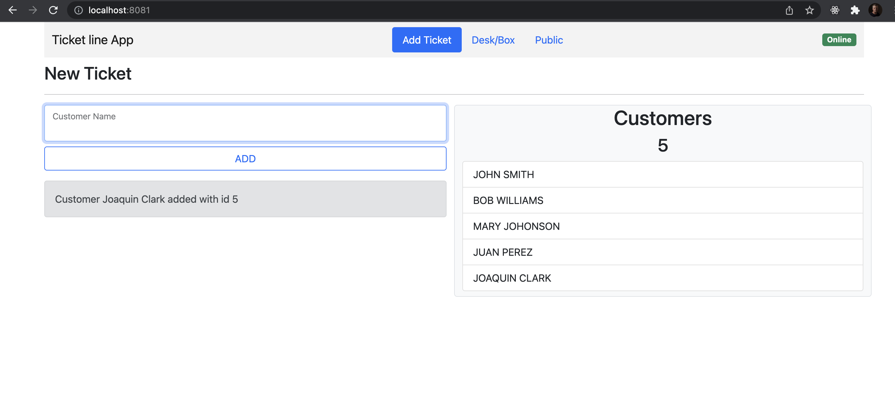
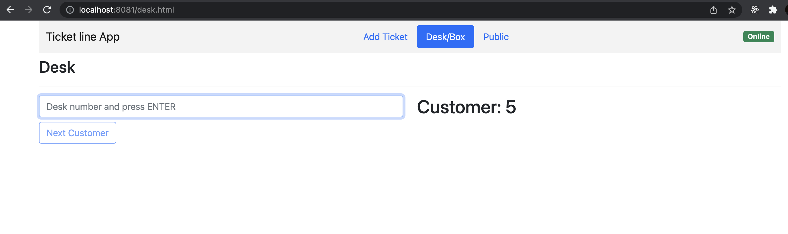
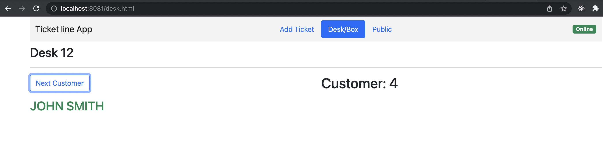

# Customer Caller. 
## Node.js(Typescript) - Socket.io - Raspberry Pi (Server) local network.

---
## Instalation: 
---
Copy the project to a folder on Raspberry or your server.

```
    # install Node 
    sudo apt-get install -y nodejs
    node -v
    npm install
    npm i onoff 
```
- Create an .env file similar to env.example.

> The "onoff" package only works on raspberry and cannot be installed on macox. It is what allows you to control the Raspberry's GPIO LED.
That is why in the environment variable it has the variable PI = 0 at the time of putting it in the raspberry change to PI = 1. </p>

```
    # run 
    node ./dist/index
```

Open www.[ip]:port example www.192.168.0.31:8080 

> NOTE: To run the application without internet daily, change the boostrap5 link to a local file. <br>


# App

The app is a caller indicating from which box or desk the call is made.

## index 

When entering the index you have to load the name of the costomer


## Desk / Box

Enter the number of Desk and press Enter. 

Press Next Customer and the app show the name. And emit event to show in public screen and turn on de led off raspberry pi. 


# SocketIO
This app is based on Socket.io and not on rest-api. When adding or calling a customer, all sales will update the necessary data. 

Online


Offline.


Everything related to socket.io from the server is controlled from sockets/controller.ts

# Raspberry

- Install OS-Linux based. 
- Install Node. 
- Connect GPIO 4 (pin 7) to a led and 68 ohm resistence  

# Documentation. 
https://nodejs.org/es/
https://socket.io/docs/v4/typescript/#types-for-the-server
https://www.typescriptlang.org/docs/handbook/2/classes.html
https://www.raspberrypi.com/software/operating-systems/
https://www.npmjs.com/package/onoff
https://www.w3schools.com/nodejs/nodejs_raspberrypi_blinking_led.asp